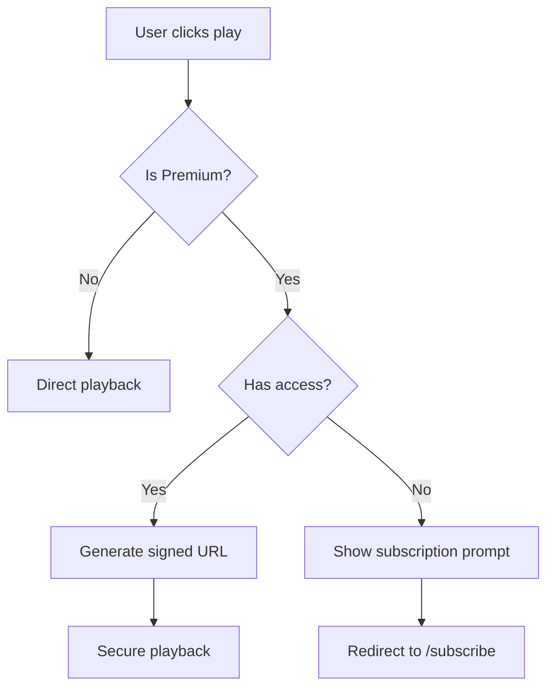

# 🌅 Morning Briefing - Podcast Playback Implementation Strategy

## 📋 **Where We Left Off (October 2, 2025 Evening):**

### ✅ **COMPLETED - Canonical Normalization System:**
- **✅ Hybrid Upload System**: `up-landscape.sh` bridges proven `up-m.sh` with structured directories
- **✅ Episode Successfully Uploaded**: "AI-Now Daily: October 2nd - Practical AI & Advanced Robotics"
- **✅ TypeScript Fixes**: Vercel deployment errors resolved and pushed
- **✅ API Routes**: Public/Private R2 endpoints configured
- **✅ Dashboard Integration**: Episode appears in podcast dashboard with normalized path

### 🎬 **Ready Episode Details:**
```json
{
  "title": "AI-Now Daily: October 2nd - Practical AI & Advanced Robotics",
  "canonicalPath": "october-2-2025-ai-now---practical-ai-advanced-robotics---deep-dive-with-alex-and-jessica-216b7799.mp4",
  "apiEndpoint": "/api/r2/public/daily/landscape/2025/10/02/...",
  "status": "Uploaded and integrated, ready for playback testing"
}
```

---

## 🎵 **MORNING FOCUS: Podcast Playback Implementation**

### **Phase 1: Playback Strategy Discussion (First Priority)**

#### **Key Questions to Address:**
1. **Player Type**: Native HTML5 audio/video player vs. custom player component?
2. **Video vs Audio**: Display video content or audio-only with visualizations?
3. **User Experience**: Embedded player, modal overlay, or dedicated player page?
4. **Premium Gating**: How to handle premium content playback restrictions?
5. **Mobile Optimization**: Responsive player design for all devices?

#### **Technical Considerations:**
```typescript
// Player Component Options:
interface PlayerOptions {
  type: 'audio' | 'video' | 'adaptive';
  controls: 'full' | 'minimal' | 'custom';
  premium: boolean;
  autoplay: boolean;
  seekable: boolean;
  downloadable: boolean;
}
```

### **Phase 2: Implementation Approaches**

#### **Option A: Native HTML5 Player**
```tsx
// Simple, reliable, browser-native
<video 
  src={episode.audioUrl}
  controls
  className="w-full"
  preload="metadata"
/>
```

#### **Option B: Custom React Player Component**
```tsx
// Advanced features, custom styling, analytics
<PodcastPlayer
  src={episode.audioUrl}
  title={episode.title}
  thumbnail={episode.thumbnail}
  isPremium={episode.isPremium}
  onProgress={handleProgress}
/>
```

#### **Option C: Third-Party Player (Plyr, Video.js, etc.)**
```tsx
// Professional features, themes, plugins
import Plyr from 'plyr-react'
<Plyr source={{ type: 'video', sources: [{ src: episode.audioUrl }] }} />
```

### **Phase 3: Premium Content Strategy**

#### **Playback Security Flow:**


---

## 🛠️ **Ready Tools & Scripts:**

### **Testing Scripts:**
- `./test-production.sh domain.vercel.app` - Production deployment testing
- `./test-canonical.sh` - Local canonical system testing  
- `./quick-upload.sh` - Upload additional episodes

### **Upload System:**
```bash
# Upload landscape episodes
./up-landscape.sh "path/to/video.mp4" landscape

# Upload premium content  
./up-landscape.sh "path/to/video.mp4" premium
```

---

## 🎯 **Morning Agenda Suggestions:**

### **1. Playback Strategy Session (30 mins)**
- Review playback options and user experience goals
- Decide on player type and feature requirements
- Plan premium content gating approach

### **2. Player Implementation (60 mins)**
- Build or integrate chosen player component
- Test with uploaded canonical episode
- Implement premium access controls

### **3. User Experience Testing (30 mins)**
- Test playback on desktop and mobile
- Verify premium gating works correctly
- Ensure smooth integration with dashboard

### **4. Production Deployment Verification**
- Verify Vercel deployment completed successfully
- Test canonical normalization endpoints in production
- Validate episode playback in live environment

---

## 📁 **Current File Structure:**
```
✅ Canonical System Ready:
├── up-landscape.sh (working upload bridge)
├── app/podcast-dashboard/page.tsx (episode integrated)
├── app/api/r2/public/[...path]/route.ts (playback endpoint)
├── app/api/r2/private/[...path]/route.ts (premium endpoint)
└── Episode uploaded: october-2-2025-ai-now...216b7799.mp4

🎯 Next: Player Implementation
├── components/PodcastPlayer.tsx (to be created)
├── Premium gating logic (to be implemented)
└── Mobile optimization (to be tested)
```

---

## 💡 **Implementation Questions for Morning:**

1. **Player Preference**: Do you want a simple HTML5 player or a custom-built player with advanced features?

2. **Video Display**: Should we display the video content or create an audio-only experience with visualizations?

3. **Premium UX**: How should premium content playback be restricted? Preview clips, login prompts, or subscription walls?

4. **Mobile Experience**: Any specific mobile playback requirements or responsive design preferences?

5. **Analytics**: Do you want to track playback statistics (play time, completion rates, etc.)?

---

**Status**: 🟢 Canonical normalization complete, ready for playback implementation
**Next Phase**: Podcast player strategy and implementation
**Ready to Resume**: Morning discussion on playback approach and user experience design

Have a great evening! The canonical normalization system is solid and ready for the next phase. 🌙